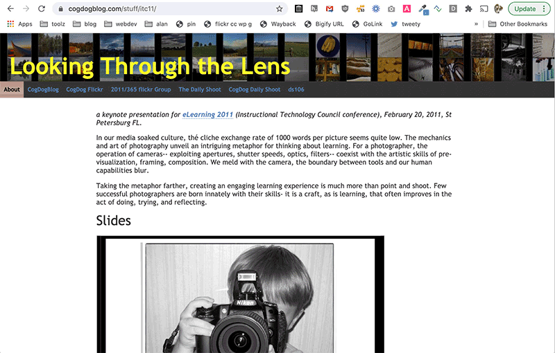

# Bigify Your Text

A silly simple tool for displaying things like web URLs for an audience to easily see very **BIG**.

Use it yourself at https://cogdog.github.io/bigify

Whatever is typed or pasted in the form field at the very bottom of the screen is bigified. This uses [FitText](http://fittextjs.com/) for scaling with window size. It probably could be done with [viewport sized typography](https://css-tricks.com/viewport-sized-typography/) if I were more clever.

Now you can use it via a browser bookmarklet tool that will Bigify the URL of the current site in a new window/tab. [Get one now](https://cogdog.github.io/bigify/bookmarklet.html)! Check it out. You can bigify the URL for any site in view:

I just did this as something to do on a cross country flight. And I need it for an upcoming workshop. Many ways this could be improved. That falls on you to fork it, eh?

## Updates

* Nov 10, 2017 Added display of a link button below the displayed text if it is a URL

* Nov 06, 2017 Created a Javascript bookmarklet tool to spawn a bigified display of the current URL in a new tab

* Oct 02, 2017 Added capability to pre-load content via query string; the current content is saved as a link via small icon in bottom right. Just copy the URL to use as a preloaded Bigif- try  https://cogdog.github.io/bigify?t=Now+you+can+preset+what+is+bigified!

* Aug 13, 2017 Thanks [John Johnston](https://github.com/troutcolor) for introducing better way to show/hide the form field. 

* Aug 13, 2017 First version hoisted here. This was created offline while on a flight from Sacramento, California to Melbourne Australia. See [I'll Take That Text Extra Large: Bigify It](https://cogdogblog.com/2017/08/bigify/)
